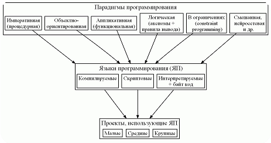
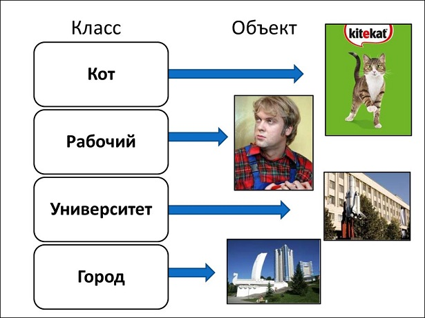
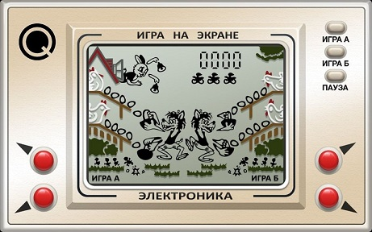
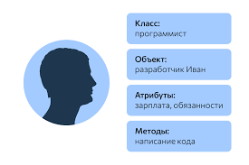
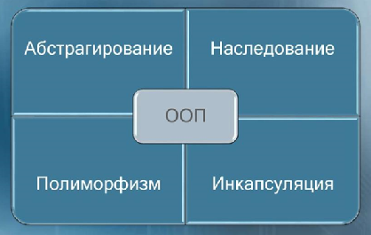
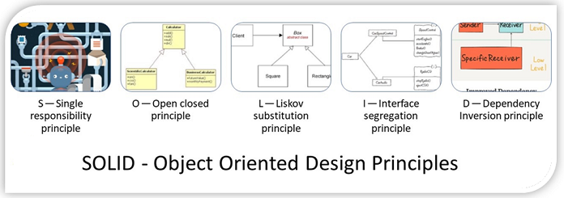
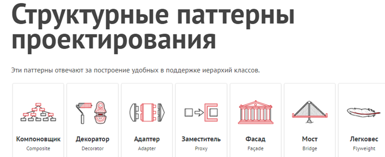
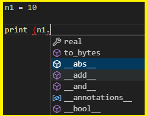

# Модуль 3. Эволюция парадигм и актуальность ООП (введение, 4 ак. ч.)

### План

*	Класс и экземпляр класса.
*	Данные экземпляра, методы экземпляра и свойства экземпляра.
*	Понятие атрибута.
*	Практикум: Создание класса и его экземпляров.


## Введение

**Академический заход:** *парадигма программирования* — это не «модный лейбл на конференции», а набор **дисциплинирующих** идей: что считается хорошей декомпозицией, какие абстракции первичны (данные, функции, процессы, объекты), какие приёмы считаются анти-паттернами. Разные парадигмы часто **сосуществуют** в одном проекте: на Python вы вольны смешивать ООП, функциональный стиль (`map`/`lambda`/ comprehensions) и процедурный скриптинг — пока архитектура не превращается в «лапшу из всего сразу».

**Инженерный сленг:** не путайте «ООП = классы везде». Классы — инструмент; когда тащите их без модели предметной области, получается **God Object** и боль на рефакторинге. Здесь мы разложим, *зачем* вообще в истории появились объекты и что Python делает «по-своему».

## Парадигмы программирования



* структурное
* функциональное
* объектно-ориентированное


<details>
<summary>подробнее про парадигмы</summary>

Теоретический фундамент функционального стиля — λ-исчисление Чёрча (1930-е); оно описывает вычисление через **применение функций**, а не через императивную память.

Первый функциональный язык LISP был создан в 1958 году Джоном МакКарти.

В 1968 году Дейкстра понял, что `goto` – это зло, и программы должны строиться из трёх базовых структур: 

> последовательности, ветвления и цикла

С этого момента появился термин структурное программирования.

Этап активного развития алгоритмических языков. 

До этого господствовали машинные коды, перфокарты и ассемблеры.

Идеи объектного моделирования оформились в **1960–1970-е** (например, Simula, затем Smalltalk): сущности с **состоянием** и **сообщениями** между ними.

Каждая из этих парадигм убирает возможности у программиста, а не добавляет.

Они говорят нам скорее, что нам не нужно делать, чем то, что нам нужно делать.


Но стоит отметить, что вплоть до начала 1990-х программисты могли свободно обходиться без ООП, пока оно не стало доминирующим направлением и внедрено в самый популярный (на тот момент) язык программирования С++. 

Так что же это такое и почему сейчас знать ООП должен каждый, уважающий себя, начинающий программист?

Для нас важно вот что: речь будет идти не просто о классах и объектах, а о том, как концепция классов и объектов реализуется в языке Python. 

Почему это важно? 

Важно потому, что сама по себе тема ООП и, более конкретно, классов и объектов, обычно достаточно сложна для понимания даже для тех, кто имеет опыт программирования. 

А в случае с языком Python проблемы, скорее всего, возникнут не только у новичков, но и у программистов, знакомых с методами ООП на примере таких языков, как C++, Java или С#.

С другой стороны, объектная модель Python относительно **минималистична** и предсказуема, если не тащить в неё чужие догмы из Java/C++ буквально.

Для тех, кто знаком с другими объектно-ориентированными языками: в `Python` класс сам является объектом. 

Это  обстоятельство имеет весьма далеко идущие последствия.

Более того, как мы уже знаем, переменные в `Python` не объявляются, а вводятся в программу путем присваивания значения. 

Это же правило остается справедливым при работе с классами и объектами. 

Отсюда получается, что процедура объявления полей, стандартная для многих языков программирования, в `Python` просто теряет смысл. 

Аналогично, многие привычные (по языкам программирования С++, Java и С#) в ООП моменты окажутся чуждыми для языка `Python`. 

Короче говоря, в магии и экзотике недостатка не будет.

</details> 


<details>
<summary>есть ли языки без ООП ?</summary>

Строгой классификации «с ООП / без» не существует: у языка может не быть **классов**, но будут **ADT**, модули, прототипы, трейты… Ниже — примеры, где **классический классовый** стиль не был изначально центральным:

🔹 **C** (процедурный ядро; «объектность» обычно ручная структурами + функциями)

🔹 **Pascal / Fortran / Cobol** (исторически разные акценты; позже появились объектные диалекты)

🔹 **Ассемблер**

🔹 **Rust** — нет классов в стиле C++; есть `struct`, `impl`, трейты (другая, но богатая абстракционная шкала)

🔹 **VBS** и прочие скриптовые — зависит от версии и рантайма

**Мораль:** вопрос не «есть ли ООП», а **какая именно** объектность и на каком уровне она вам нужна.

</details> 





Чтобы понять ООП иногда требуется провести параллели с окружающим миром 




<details>
<summary>Что такое ООП</summary>
Что такое ООП? Это такой стиль написания программы, при которой её отдельные компоненты представляются нам объектами из окружающего нас мира.

Самым удачным примером является реализация знакомой всем видеоигры, где волк ловит яйца. В этой игре сущностей, которыми приходится оперировать всего несколько:

🔹 Волк

🔹 Яйцо

🔹 Стойка, по которой катится яйцо


Представьте, что с точки зрения написания программы каждая из этих сущностей обладает своим "чертежом", по которому она создается. 

Чертеж вы создаёте единожды для каждой сущности, а дальше клепаете по ним столько объектов, сколько вам угодно!

Те, кто не знаком с искусством разработки могут удивиться, но во многом именно так и создаются современные видеоигры!
</details>


### 1. Что такое ООП?



- Программирование, построенное на классах
- Инструмент стратегического планирования
- Программная единица пакетирования логики и данных

<details>
<summary>...</summary>

* ООП — эффективный способ программирования, который предусматривает разложение кода на составляющие с целью минимизации избыточности и написания новых программ путем настройки существующего кода, а не его изменения на месте

* ООП — это одна из парадигм разработки, подразумевающая организацию программного кода, ориентируясь на данные и объекты, а не на функции и логические структуры.

* ООП — методология или стиль программирования на основе описания типов/моделей предметной области и их взаимодействия, представленных порождением из прототипов или как экземпляры классов, которые образуют иерархию наследования
</details>





### ОО ДИЗАЙН 



### Принципы «дяди Боба» (Robert C. Martin, SOLID и смежные идеи)


### ОО-паттерны


### Банда 4-x


Обучение тому, как задействовать классы, требует времени. 

На практике ООП также влечет за собой значительную
работу по проектированию, чтобы получить все преимущества от многократного использования кода классов. 

С этой целью программисты начали каталогизировать распространенные структуры ООП, известные как паттерны проектирования, которые призваны помочь в решении проблем, возникающих при проектировании. 

Однако действительный код, который вы пишете с применением ООП в Python, настолько прост, что сам по себе он не будет дополнительным препятствием ОО-программирования.

* ядро **Linux** в основном на **C** (без «классов» в Java-смысле)

* интерпретатор **CPython** написан на C; внутри, конечно, есть объекты PyObject — это уже **объектная C-реализация**, просто не ваш пользовательский `class`)

* **IoT / МК** — часто C и ассемблер; ООП накатывается там, где позволяет железо и команда


### Пример-анти-пример 

вспомним курс `Python-1`

```python
печать = print
print = 123
печать (print)
```

> в нем мы переназначили встроенную функцию print, а потом еще и переопределили её. Питон это позволяет!

А теперь еще круче ... 

```python
n1 = int(10)
n2 = 20

print(type(n1), )
```

#### Что делает функция type?

> <class 'int'>

давайте провалимся как в определение ф-ции или класса int



Что такое класс int?

#### А теперь немного магии

```python
n1 = 10
n2 = 20
print(n1 + n2)
print(n1.__add__(n2))
```


```python
class int(int):  # учебный трюк: подкласс встроенного int; в проде так не делают

    def __add__(n, value):
        return n * value


n1 = int(10)
n2 = 5

print(n1 + n2)  # 50
```
> 50 

_Что вообще происходит ?_

> ###  Можно ли в Питоне складывать числа со строками?

```
ответ джуна, ответ синьора
```

> ###  Чем функция отличается от метода? (print, int, string ...)

```python
set_a = {1, 2, 3, 4, 5}
set_b = {5, 6, 7}

print(set_a & set_b)
print(set_a.intersection(set_b))
print(set_a.__and__(set_b))
```


```python
x = 1.5
print(x.as_integer_ratio())

y = 15

print(y.bit_count())
print(type(y))

x = bin(y)
```


```python
print(type(type))

s = "ABCDE"
res = s.lower
print(1, res)  # ссылка на bound-method / built-in method
res1 = s.lower()
print(2, res1)  # 'abcde'
```

**Без скобок** вы получаете объект «метод / callable» (ещё не вызванный). **Со скобками** — результат вызова.

Об этом подробнее в лекции про методы.


## 1 задача - научиться наследоваться от встроенных классов `Python` и изменять их
## 2 задача - создавать свои пользовательские типы данных на основе классов
